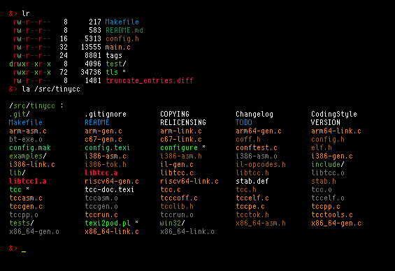
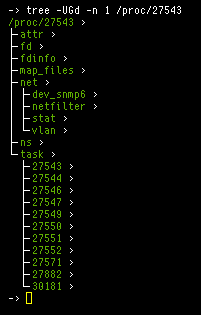

# tls - tiny implementation of ls.

## options
   - -1  one file per line
   - -a  show all files
   - -A  filter `.` and `..`
   - -C  print columns
   - -G  show color, indicators, and links
   - -V  sort files given as arguments
   - -f  no sort
   - -r  reverse sort
   - -l  long listing
   - -o  * show owner
   - -g  * show group
   - -n  * show numerical IDs
   - -t  * show time of last modification

---

# tree - list files recursively

## options
   - -a  show hidden files
   - -d  list only directories
   - -n  max depth
   - -p  print full path of files
   - -s  print file size
   - -o  print owner
   - -g  print group
   - -t  print time
   - -G  show color
   - -I  indent recursively
   - -A  show ascii graphics
   - -U  show unicode graphics
   - -Y  use yaml format
   - -J  use json format
