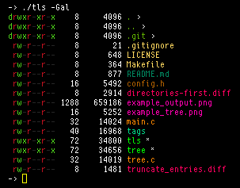
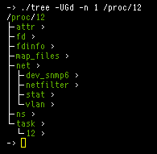

# ls - list files in a directory



## options

```
ls -[afr1ACGV] [file ...]
ls -[logntafr1ACGV] [file ...]
```

| option | short description
|--------|------------------------------
| -1     | one file per line
| -a     | show all files
| -A     | filter `.` and `..`
| -C     | print columns
| -G     | show color, indicators, and links
| -V     | sort files given as arguments
| -f     | no sort
| -r     | reverse sort
| -l     | long listing
| -o     | show owner
| -g     | show group
| -n     | show numerical IDs
| -t     | show time of last modification

> all -\[ognt\] options only apply to -l

---

# tree - list files recursively



## options

```
tree -[adnpsogtGIAU] [file ...]
tree -[adnpsogtYJ] [file ...]
```

| option | short description
|--------|------------------------------
| -a     | show hidden files
| -d     | list only directories
| -n     | max depth
| -p     | print full path of files
| -s     | print file size
| -o     | print owner
| -g     | print group
| -t     | print time
| -G     | show color
| -I     | indent recursively
| -A     | show ascii graphics
| -U     | show unicode graphics
| -Y     | use yaml format
| -J     | use json format

> -G option oly works with -\[IAU\]
